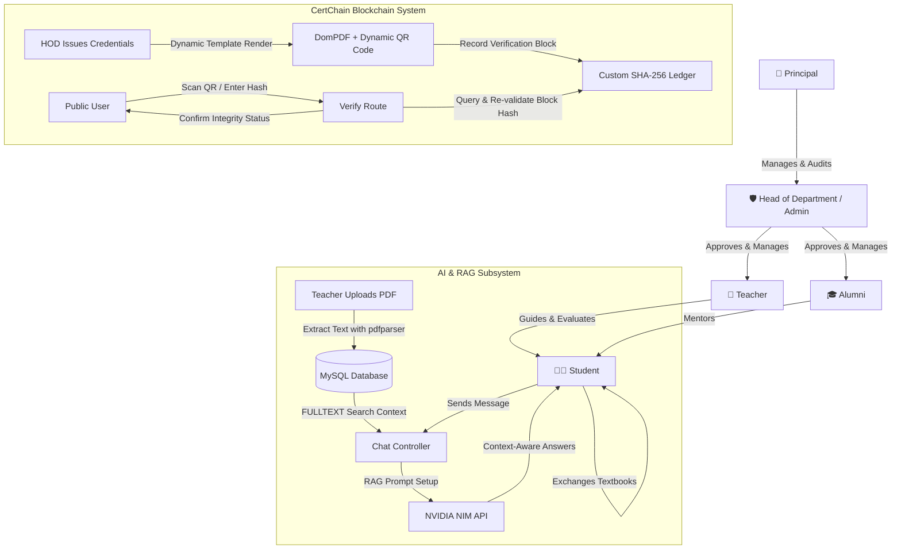

# 🎓 Drivedo - Complete Project Documentation & Technical Overview

Welcome to the comprehensive technical documentation for Drivedo, a state-of-the-art, feature-dense Academic Portal, Blockchain-secured Credential Hub, Peer Book Exchange, and Career Onboarding System.

Built using the robust **Laravel 13** framework, **PHP 8.3**, and **MySQL/MariaDB**,Drivedo represents a next-generation academic operating system. It merges standard school administration tasks with advanced modules like an NVIDIA-driven AI Retrieval-Augmented Generation (RAG) assistant, a custom proof-of-concept cryptographic blockchain for credentials (CertChain), a student-to-student text-book exchange marketplace (Bookloop), and an Alumni Mentorship network.

---

## 🛠️ The Technical Stack

Drivedo is built on a modern, highly optimized enterprise-grade software stack:

| Layer | Technology | Purpose |
| :--- | :--- | :--- |
| **Core Framework** | Laravel ^13.0 (PHP ^8.3) | Clean MVC architecture, secure routing, database migrations, seeders, Eloquent ORM, and middleware pipeline. |
| **Database** | MySQL / MariaDB | Relational schema with specialized indexes, foreign key constraints, and `FULLTEXT` indexing on parsed document content. |
| **Frontend Styling** | TailwindCSS v4.0 & Vite | Ultra-fast utility-first CSS compilation, dynamic asset packaging, fluid animations, and a polished minimalist white-and-black theme aesthetic. |
| **Asynchronous Requests**| Axios | Handles real-time API integrations, file management, and instant chatbot communications. |
| **Artificial Intelligence** | NVIDIA NIM Chat API | Powered by advanced models (e.g., `moonshotai/kimi-k2.6`), delivering high-speed academic RAG responses and ATS-optimized resume analysis. |
| **Cryptographic Blockchain** | PHP Custom Ledgers | Custom SHA-256 block creation, previous block validation hash mapping, and integrity validation algorithms. |
| **PDF Text Parsing** | `smalot/pdfparser` | Extracts full text from lecture slides and study guides during the teacher upload pipeline. |
| **Certificate Output** | `barryvdh/laravel-dompdf` | Programmatic dynamic HTML-to-PDF rendering engine for generating verifiable academic certificates. |
| **Data Exports** | `maatwebsite/excel` & `setasign/fpdf` | Robust CSV/Excel generation for HOD-level reports, and PDF drawing tools. |
| **QR Code Engine** | `simplesoftwareio/simple-qrcode` | Dynamically embeds cryptographic validation links into public certificate templates. |
| **Access Management** | `spatie/laravel-permission` | Granular multi-role gates protecting routes and views (Principal, HOD, Teacher, Alumni, Student). |

---

## 🏗️ System Architecture & Data Flow

The following architecture diagram represents the nested hierarchy of users and the flow of information across the AI, database, and CertChain blockchain systems:



---

## 📌 Problem & Integrated Solution Matrix

Drivedo was built to address critical, long-standing inefficiencies in academic institutions:

### 1. The Fragmentation of Study Material
* **The Problem:** Academic resources (lecture slides, research papers, syllabus documents) are scattered across third-party links, personal email threads, and group chats. Finding past resources is chaotic.
* **The Solution:** A secure, structured file hub. Teachers upload files (up to 10MB) which are auto-sorted by MIME-type into folders (Documents, Images, Audio, Video). Students gain real-time, read-only indexed access.

### 2. High Cognitive Load of Reading Dense Academic PDFs
* **The Problem:** Students spend hours reading 100-page lecture materials or academic books to answer a single question or find a definition.
* **The Solution:** **AI Retrieval-Augmented Generation (RAG) assistant.** On upload, `smalot/pdfparser` extracts full text and saves it into the database. A student queries the system, the database retrieves relevant sections using database full-text indexes, feeds the extracted context into a **Kimi-k2.6** model hosted on **NVIDIA NIM**, and spits out an exact answer with source citations.

### 3. Academic Credential Forgery
* **The Problem:** The global rise of fake degrees, falsified achievement credentials, and slow manual certificate verification processes.
* **The Solution:** **CertChain Blockchain Ledger.** Certificates are issued through dynamic HTML templates by the HOD. When a certificate is issued, a block is written into a local cryptographic blockchain ledger using sequential SHA-256 hashes linking the current block's payload to the previous block's hash. A unique verification link is embedded as a QR code. A public verification route `/verify/{id}` recalculates block integrity on-the-fly via PHP's `hash('sha256')` algorithm to verify it hasn't been tampered with.

### 4. Administrative Bottlenecks in Daily Operations
* **The Problem:** Head of Departments (HODs) and Teachers waste hours manually designing weekly class timetables, typing out attendance sheets, and printing reports.
* **The Solution:** Integrated admin scheduling engine. HODs link subjects and teachers on an interactive web grid that compiles print-ready timetables. Teachers mark daily attendance on a unified semester roster or utilize bulk attendance utilities, exporting professional reports instantly to CSV.

### 5. Excessive Costs of Academic Textbooks
* **The Problem:** Students spend enormous amounts of money on textbooks each semester, while senior students stack unused past textbooks in their closets.
* **The Solution:** **BookExchange (Bookloop).** A localized student-to-student marketplace. Students list books for donation, sale, or trade. The built-in messaging portal lets students open a secure chat channel mapped directly to each book listing, facilitating peer negotiation and handovers.

### 6. Gap Between Students & Real-World Industry Alumni
* **The Problem:** College students lack direct access to guidance from professionals who graduated from the exact same institution.
* **The Solution:** **Alumni Mentorship Network.** Verified alumni join the portal by inputting professional information (Company, graduation branch, professional bio). Students browse the verified directory and click "Request Mentorship". Mapped chat sessions are created so students receive tailored career advice.

### 7. Automated Professional Career Coaching
* **The Problem:** Students have poorly formatted resumes that get instantly rejected by Applicant Tracking Systems (ATS) when applying for internships.
* **The Solution:** **AI Resume Analyzer.** Students upload their resumes (PDF, TXT, DOCX) directly into their marketplace panel. The NVIDIA AI Career Advisor extracts the text, scores the resume against ATS standards, analyzes impact and metric-driven writing, highlights formatting issues, and suggests detailed professional enhancements.

---

## 💎 Features & Module Breakdown

### 🔐 1. Role-Based Access Control (RBAC) & Approvals
* **Multi-Role Authentication:** Standardized Laravel custom auth guards mapping students, teachers, alumni, Head of Department admins, and the institution's Principal.
* **Vetting Gateways:** 
  - Teacher and Alumni signups go to a "Pending" pool.
  - HODs or Principals review signups and toggle approval status before users are granted system clearance.
  - Custom middleware classes (`AuthTeacher`, `AuthStudent`, `AuthAdmin`, `AuthAlumni`, `AuthPrincipal`) protect backend controller entry points.

### 📁 2. Study Portal & NVIDIA RAG Agent
* **Adaptive File Storage:** Dynamic folder generator maps file paths to unique sanitized user folders: `storage/uploads/<username>/[documents/images/audio/video]`.
* **Deep Text Indexing:** Extracts text from uploads to store in database `LONGTEXT` fields with `FULLTEXT` indexing.
* **Academic RAG Bot:** Retains dynamic conversation history (last 5 back-and-forths) for continuous, context-aware student chat.
* **ATS Resume Coach:** Fully integrated API endpoint allowing real-time PDF extraction and modular evaluation of corporate readiness.

### ⛓️ 3. CertChain Blockchain & Verification
* **Cryptographic Block Mining:** Model representation storing `block_index`, `certificate_uid`, `previous_hash`, `data_hash`, `block_hash`, and transaction metadata.
* **Automatic Proof-of-Work / Integrity Check:**
  ```php
  public function isIntact(): bool
  {
      $recomputed = hash('sha256',
          $this->block_index .
          $this->previous_hash .
          $this->data_hash .
          $this->mined_at->timestamp
      );
      return $recomputed === $this->block_hash;
  }
  ```
* **Verifiable QR Integration:** Programmatic creation of standard QR codes representing the verification URL.
* **Dynamic Template Manager:** Admin interface allowing HODs to create beautiful customized HTML/CSS styling templates for student certificates.

### 📅 4. Operations, Attendance & Timetables
* **Roster Enrollment:** CSV imports and subject mapping to semester batches.
* **Bulk Attendance Processor:** Unified grid rendering students for instant toggle-based attendance scoring. Includes monthly report generators with automatic percentage math.
* **Timetable Builder:** Admin layout interface for establishing slots, assigning classrooms, avoiding scheduling overlaps, and rendering print layouts.
* **Broadcast Boards:** Dedicated notifications and bulleted notice boards for institution-wide communications, separating HOD notices from faculty updates.

### 🔁 5. Peer-to-Peer Book Exchange
* **Directory Search:** Real-time search across categories, branches, and book titles.
* **Secure Communications:** Isolated messaging logs between student buyers and student sellers. Mapped to listing IDs to ensure transparency.
* **Roster Listing Controls:** Students manage their books, marking listings as "Available", "Pending Exchange", or "Exchanged" (which suspends them from public search results).

### 💼 6. Project & Internship Marketplace
* **Branch Isolation:** A tailored feed exclusive to students from Engineering branches (CS, IT, Electronics) focusing on technical project sharing and industry internships.
* **Profile Setup & Feed Tracking:** Interactive card view mapping user skills, repositories, project milestones, and internship status.

---

## 📈 Key Advantages & Value Propositions

* **For the Educational Institution:**
  - **Zero Cost Security:** CertChain replaces expensive third-party credentialing products with a fast, self-hosted, tamper-proof local blockchain.
  - **Autonomy:** Decentralized setup where the Principal supervises all Departments, and each HOD administers their own teachers, students, timetables, and subjects.

* **For Faculty & Instructors:**
  - **Administrative Relief:** Say goodbye to manual excel formatting. Daily attendance, monthly ratios, class timetables, and quiz attempts are managed inside a unified modern dashboard.
  - **AI Teaching Assistant:** Teachers upload material once, and the RAG assistant handles student repetitive questions 24/7.

* **For Students:**
  - **Accelerated Learning:** Direct questioning of heavy PDFs means students grasp complex formulas and theories in seconds.
  - **Career-Ready Support:** The AI Resume Advisor, dynamic Alumni sessions, and CS/IT Internship Marketplace bridge the gap between academic theory and high-tech corporate recruitment.
  - **Student-Friendly Economy:** Bookloop and Book Exchange lower textbook costs and foster sustainability within the student community.

---

**Drivedo** stands as a stellar modern integration of standard educational management utilities with blockchain security and cognitive AI, providing a state-of-the-art administrative, study, and social hub.


## License

The Laravel framework is open-sourced software licensed under the [MIT license](https://opensource.org/licenses/MIT).
